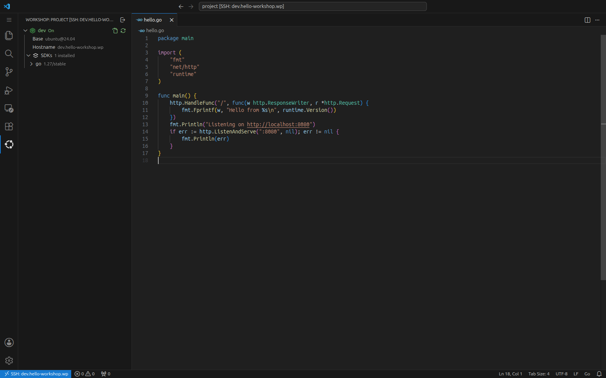
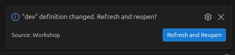

# Workshop — VS Code Extension

Develop inside [Workshop](https://ubuntu.com/workshop) containers directly from VS Code. Workshop launches [LXD](https://canonical.com/lxd) system containers with Ubuntu from simple YAML definitions checked into your project, giving each project a clean, reproducible environment that the whole team shares.



## Features

- **Workshops view** in the Activity Bar: every workshop defined in the project with its status, base, hostname, and installed SDKs.
- **Add New Workshop**: a wizard that picks SDKs from the Canonical reference catalogue, a base, and a name, then runs `workshop init` for you.
- **Reopen in Workshop**: launches or starts the workshop if needed and reconnects the window to it over SSH, with the project mounted at `/project`.
- **Refresh and Reopen**: offered automatically when a definition file changes; rebuilds the workshop and reconnects.
- **Failure handling**: a rejected definition opens next to the daemon's error log; a refresh that fails halfway pauses, and you choose between **Reopen and Debug**, **Continue Refresh**, and **Abort Refresh**.
- **Reopen Locally** from the Workshops view or the remote indicator, and **Turn Off…** to remove the container while keeping the definition.



## Requirements

- **OS**: Ubuntu 22.04 or later
- **Architecture**: amd64 or arm64
- **[LXD](https://snapcraft.io/lxd)** from the `6/stable` channel:
  ```bash
  sudo snap refresh lxd --channel=6/stable
  ```
- **[Workshop](https://snapcraft.io/workshop)** 0.9.5 or later:
  ```bash
  snap install workshop --classic
  ```
- **[Remote - SSH](https://marketplace.visualstudio.com/items?itemName=ms-vscode-remote.remote-ssh)**, installed automatically as a dependency

## Getting Started

1. Open a project folder in VS Code and click the **Workshop** icon in the Activity Bar.

2. Click **Add New Workshop**, pick your SDKs (for example `go`), keep the default base and the name `dev`, and confirm. The wizard creates `.workshop/dev.yaml` and opens it. You can also create the definition from a terminal:

   ```bash
   workshop init dev --sdks go/1.27/stable
   ```

   See [Reference SDKs](https://github.com/canonical/reference-sdks) for the full catalogue of SDKs maintained by Canonical.

3. Click **Reopen in Workshop** in the notification, or next to the workshop in the Workshops view. VS Code launches the workshop and reconnects inside the container; the integrated terminal now runs there.

To return to your local window at any time, click **Reopen Locally** in the Workshops view or in the remote indicator in the status bar.

The step-by-step guide, including refreshing a workshop after a definition change and recovering from a broken definition, is in the Workshop documentation: [How to develop in a workshop with VS Code](https://ubuntu.com/workshop/docs/how-to/develop-with-workshops/connect-vscode/).

## Restricted Mode

When VS Code opens a folder in Restricted Mode (untrusted workspace), most extensions, including this one, are disabled, which prevents using the Workshop panel to reconnect or reopen locally.

To allow this extension to run even in untrusted workspaces, add the following to your user **settings.json** (`Ctrl+Shift+P` → _Open User Settings (JSON)_):

```json
{
  "extensions.supportUntrustedWorkspaces": {
    "canonical.workshop": {
      "supported": true
    }
  }
}
```

With this in place, the Workshop panel remains active in restricted mode so you can open the project in a workshop sandbox and continue not trusting it on the host.

## Development

This project uses Workshop for its development environment:

```bash
workshop launch
workshop connect ext/test-deps:desktop
```

Open the project in VS Code and press `F5` to start an Extension Development Host.

Useful commands:

```bash
workshop run -- test
workshop run -- build
```
